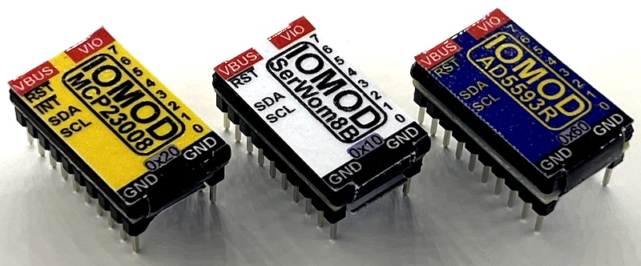
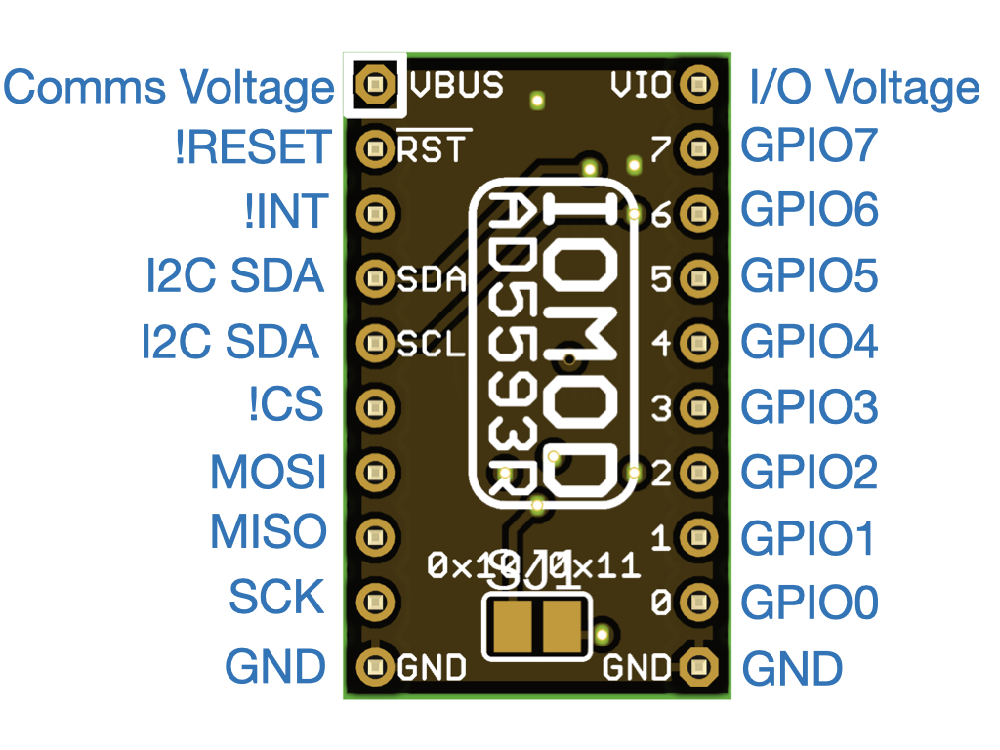
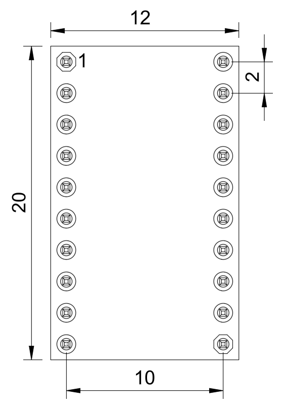
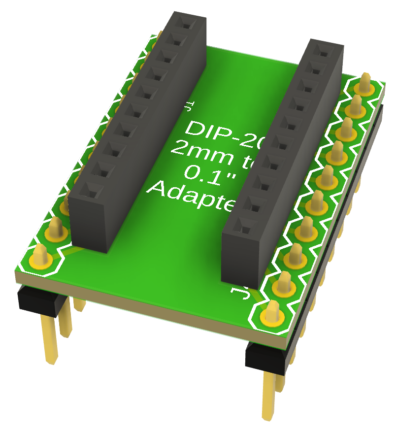
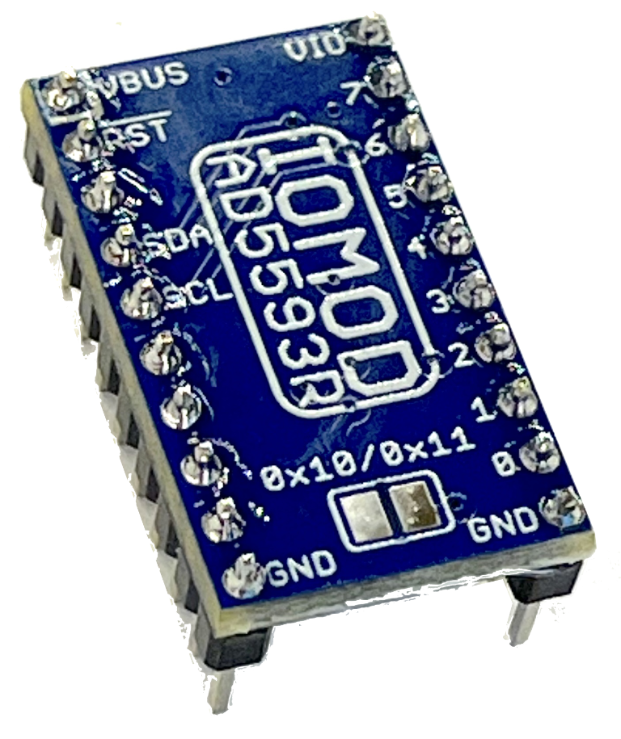
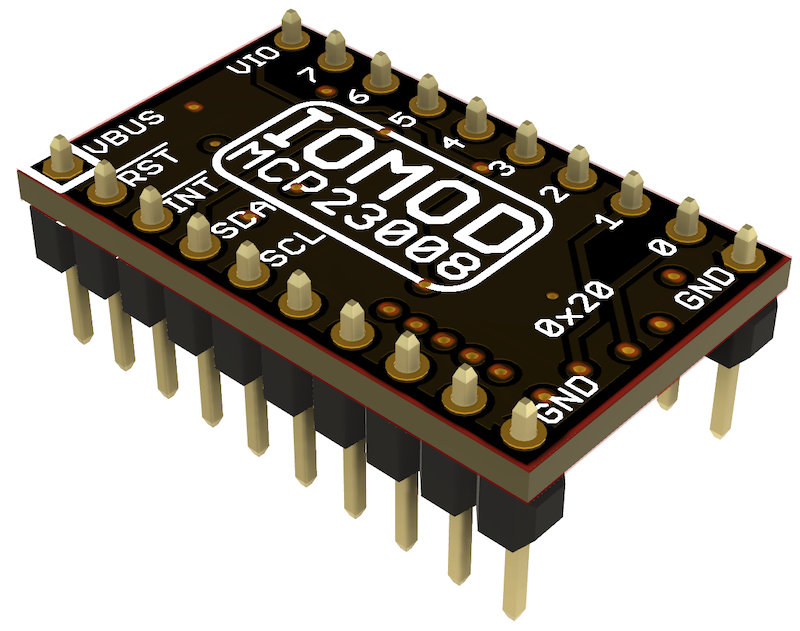
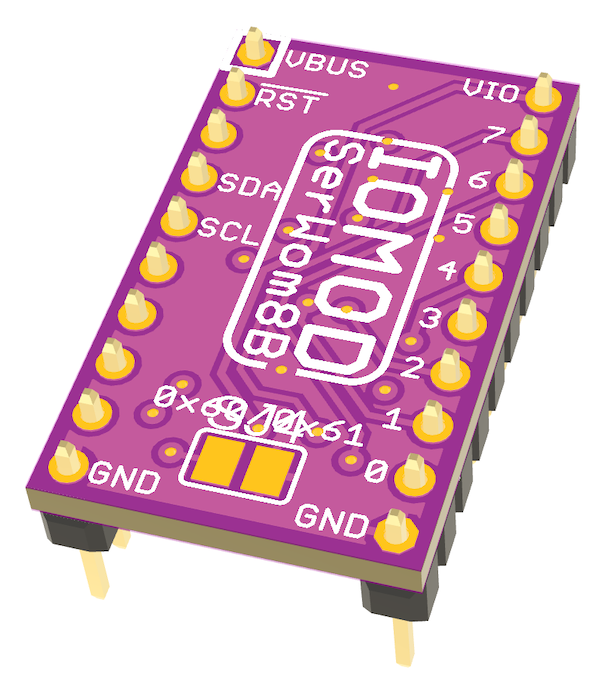

# IOMOD Multi-Purpose I/O Module

*Copyright 2025 SuperHouse Automation Pty Ltd  
[www.superhouse.tv]()*

IOMOD is a mechanical and electrical convention for creating pluggable 
I/O modules for use in test systems and other projects.

The module pinout allows for either I2C or SPI connections to modules, 
and up to 8 I/O pins per module. Modules can also optionally support two 
power domains so that data connections to the host can be at a different 
voltage to connections to the target device.

4 reference implementations have been created so far:

 * AD5593R (I2C)
 * MCP23008 (I2C)
 * MCP23S08 (SPI)
 * Serial Wombat 8B (I2C)

These reference implementations have been designed "upside down", so 
that when they are assembled the parts will be underneath the module. 
This allows the top of the module to be totally flat except for the tops 
of the header pins and their solder joints.

Note: The format is DIP, but it's NOT on a 0.1" grid! That means you
can't plug it into a breadboard. The format is 2mm pitch metric DIP with
10mm row spacing center-to-center. An adapter module design is also 
provided to allow easy use in a breadboard.

Originally developed for the [Testomatic PCB test jig system](https://github.com/superhouse/testomatic).

The Testomatic chassis includes sockets for 7 IOMODs, allowing different 
modules to be installed based on the specific requirements of the test 
plan for the Device Under Test.

## IOMOD Pinout

IOMOD designs are not required to implement all signals. Typically an I2C-based 
module will leave the SPI-related pins unconnected, and vice versa. Modules 
may also not implement signals such as the active-low interrupt output or 
the reset pin, and they may not implement all 8 GPIO signals.

For example, a module designed specifically for a high-speed SPI 
single-channel precision ADC may implement a single GPIO and leave 
the rest unconnected. This is perfectly valid if it suits your use-case.

Modules may also choose to fully isolate the power domains, with a 
floating GND on the I/O side split from the signal GND on the control side. 
The reference designs included here tie both GND pins together as a 
common reference but this is not required if you are implementing full 
isolation.

## IOMOD Mechanical Dimensions

## 2mm-to-0.1" Adapter

## IOMOD-AD5593R

This variant is designed to be a generic I/O module that provides basic
features to cover typical use cases where high ADC precision, etc is
not required. It's very flexible because it can handle both analog and 
digital input and output with true analog output via the DAC, but unfortunately 
the AD5593R chips are quite expensive.

**Features**

 * AD5593R I/O expander.
 * I2C interface.
 * 8 I/O pins.
 * 3.3V or 5V control interface.
 * 3.3V or 5V I/O interface.
 * Every pin can be individually configured.
 * Digital I/O on every pin.
 * 12-bit ADC on every pin.
 * 12-bit DAC on every pin.

For use with Arduino, see Rob Tillaart's excellent library at [github.com/RobTillaart/AD5593R](https://github.com/RobTillaart/AD5593R)

## IOMOD-MCP23008

This variant is based on the extremely popular MCP23008 I2C I/O expander 
chip, which means it has excellent driver support. However, it is only 
capable of digital input and output. It doesn't support analog I/O at all. 
This makes it less flexible than the AD5593R module, but probably simpler 
to set up in terms of software support. It's also significantly cheaper. 

**Features**

 * MCP23008 I/O expander.
 * I2C interface.
 * 8 I/O pins.
 * 3.3V or 5V control interface.
 * 3.3V or 5V I/O interface.
 * Digital I/O on every pin.

## IOMOD-MCP23S08

This variant has the same features as the MCP23008 module, except that it 
uses SPI for communication with the host. It was implemented mostly to 
validate that the IOMOD header format is also useful for SPI-based modules.

**Features**

 * MCP23S08 I/O expander.
 * SPI interface.
 * 8 I/O pins.
 * 3.3V or 5V control interface.
 * 3.3V or 5V I/O interface.
 * Digital I/O on every pin.

## IOMOD-SW8B

This variant is based on 
[SerialWombat from Broadwell Consulting](https://www.serialwombat.com/), 
which is a project to create an extremely flexible I/O expander using 
readily available MCUs. This IOMOD is based on the CH32V003 MCU, the same 
as used on the [SerialWombat 8B](https://www.kickstarter.com/projects/bwci/serial-wombat-8b-i2c-i-o-boards-big-features-small-money).

Because SerialWombat firmware allows advanced functionality to be 
offloaded to the I/O expander, it can be configured by the host and then 
left to handle its own tasks such as driving PWM, reading encoder 
signals, etc.

More information to come.

INSTALLATION
------------
Schematics and PCBs were created in Fusion360 and exported as EAGLE format,
which can be imported back into Fusion360 or various other packages including KiCAD.

CREDITS
-------
Designed by Jonathan Oxer jon@oxer.com.au

DISTRIBUTION
------------
The specific terms of distribution of this project are governed by the
license referenced below.

LICENSE
-------
Licensed under the TAPR Open Hardware License (www.tapr.org/OHL).
The "license" folder within this repository also contains a copy of
this license in plain text format.
