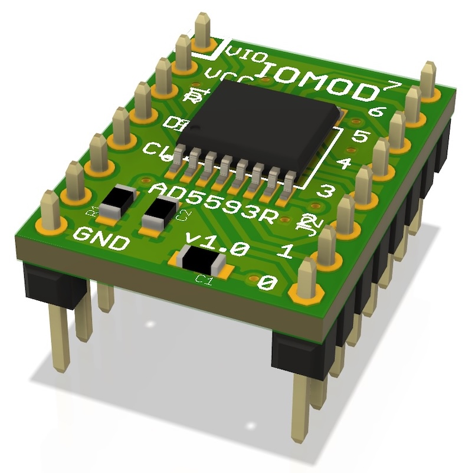
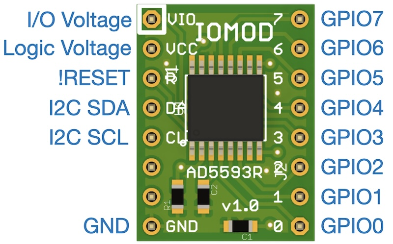
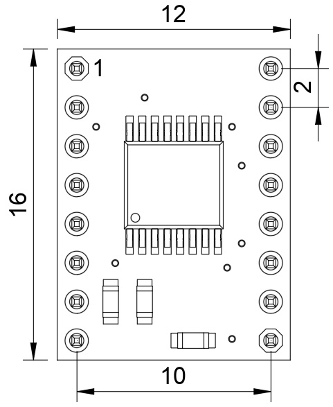
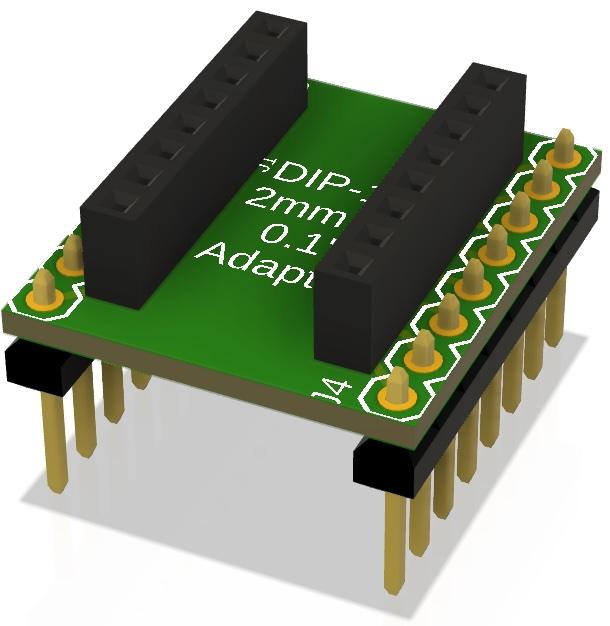

Multi-purpose I/O Module
========================

Copyright 2025 SuperHouse Automation Pty Ltd  www.superhouse.tv

A general-purpose I/O module for the Testomatic PCB test jig system
and other projects.

Testomatic provides sockets for I/O modules, allowing the capabilities
of the test jig to be customised to suit specific requirements. This
module is designed to be a generic I/O module that provides basic
features to cover typical use cases where high ADC precision, etc is
not required.

Features:

 * AD5593R I/O expander.
 * 8 I/O pins.
 * I2C interface.
 * 3.3V or 5V control interface.
 * 3.3V or 5V I/O interface.
 * Every pin can be individually configured.
 * Digital I/O on every pin.
 * 12-bit ADC on every pin.
 * 12-bit DAC on every pin.

Note: The format is DIP, but it's NOT on a 0.1" grid! That means you
can't plug it into a breadboard. The format is 2mm pitch metric DIP with
10mm row spacing center-to-center.

Also included is the design for a simple 2mm-to-0.1" breakout board, which
you can use to make the module breadboard-friendly.

More information:

  [www.superhouse.tv/iomod](http://www.superhouse.tv/iomod)

INSTALLATION
------------
This project is saved as Fusion360 board and schematic files.

CREDITS
-------
Designed by Jonathan Oxer jon@oxer.com.au

DISTRIBUTION
------------
The specific terms of distribution of this project are governed by the
license referenced below.

LICENSE
-------
Licensed under the TAPR Open Hardware License (www.tapr.org/OHL).
The "license" folder within this repository also contains a copy of
this license in plain text format.
